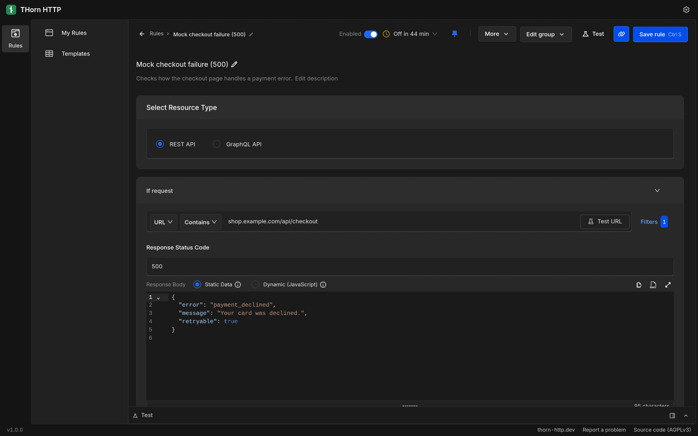
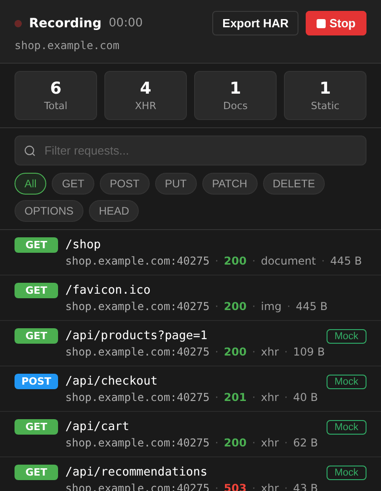
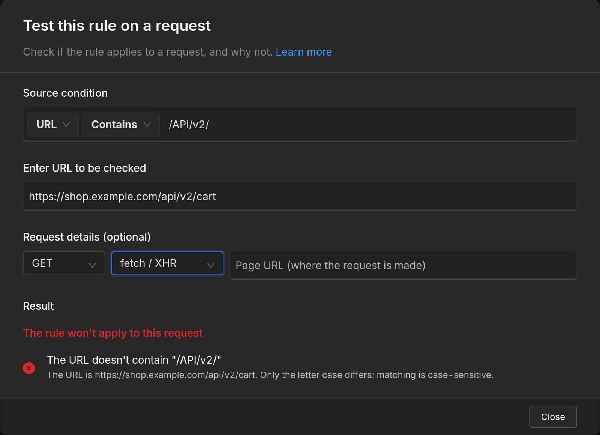
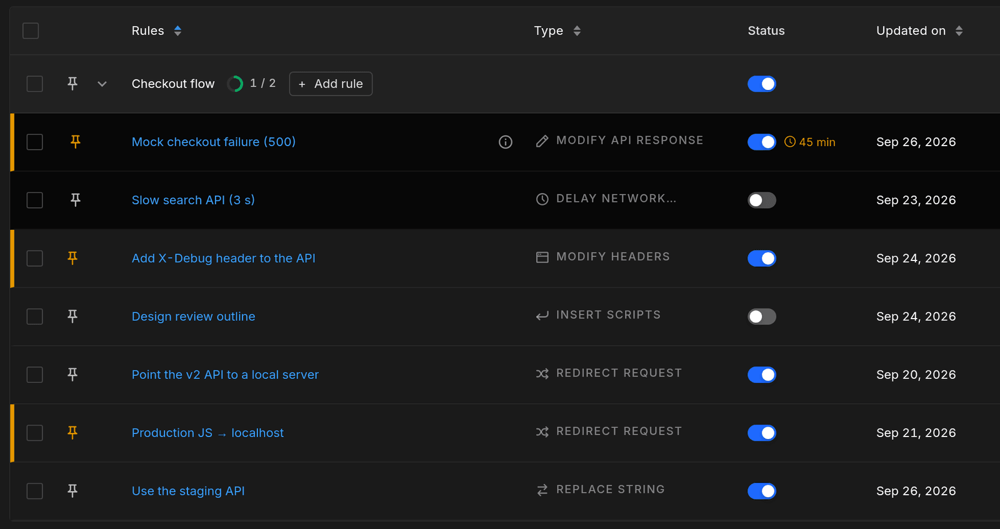
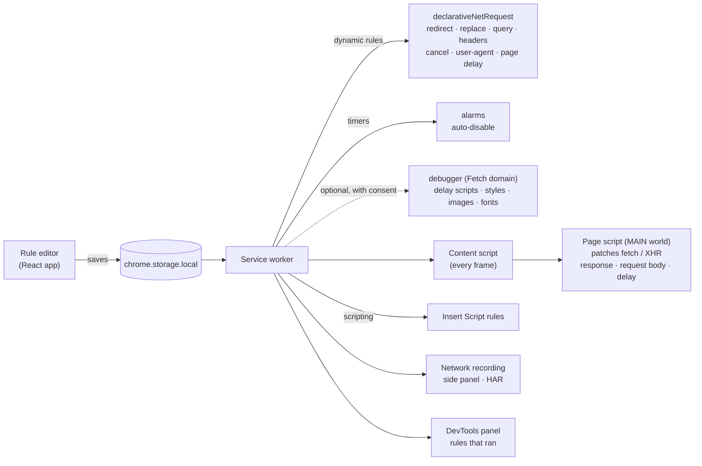

<div align="center">


# THorn HTTP

**Intercept and modify HTTP requests, right in your browser.**
Free, open source and local-first: no account, no backend, no tracking.

[](https://github.com/Thorn-http/thorn-http/actions/workflows/ci.yml)
[](./LICENSE)
[](#browser-support)
[](#browser-support)


[Website](https://thorn-http.dev) · [Features](#features) · [Install](#install) · [Privacy](#privacy-and-security) · [Development](#development) · [Roadmap](./ROADMAP.md)



</div>

---

## Table of contents

- [Why THorn HTTP](#why-thorn-http)
- [Features](#features)
  - [Rule types](#rule-types)
  - [Highlights](#highlights)
  - [Also included](#also-included)
- [Browser support](#browser-support)
- [Install](#install)
- [Quick start](#quick-start)
- [Privacy and security](#privacy-and-security)
  - [Permissions](#permissions)
- [How it works](#how-it-works)
- [Development](#development)
  - [Repository layout](#repository-layout)
  - [Build](#build)
  - [Test](#test)
  - [Release](#release)
- [Contributing](#contributing)
- [Support the project](#support-the-project)
- [FAQ](#faq)
- [License and attribution](#license-and-attribution)

---

## Why THorn HTTP

|  |  |
| --- | --- |
| 🎁 **Free, no limits** | Unlimited rules, mocks and groups. No paid plan, no team seats, no feature behind a paywall. |
| 💻 **Local by default** | Rules and recordings live in your browser. Today, no feature sends your rules or your traffic to a server, ours included. If an online feature is ever added, it will be optional and off until you turn it on. |
| 🔍 **Open source** | GNU AGPLv3. Anyone can read, audit and build the code. Sensitive permissions are optional and explained before they are requested. |

THorn HTTP started as a fork of [Requestly's browser extension](https://github.com/requestly/interceptor). It keeps the interceptor and removes everything that needed an account or a server: sign-in, teams, sync, cloud mocks, billing, analytics and remote configuration.

## Features

### Rule types

Test any network scenario without waiting for a deploy or a backend change.

| Rule | What it does | Example |
| --- | --- | --- |
| **Redirect** | Send a URL, or any URL matching a pattern, somewhere else. | `app.example.com/main.js → localhost:5173` |
| **Replace string** | Replace part of the URL: host, path, API version. | `/v1/ → /v2/` |
| **Query params** | Add, change or remove query parameters. | `+ debug=true` |
| **Modify headers** | Add, change or remove request and response headers. | `Access-Control-Allow-Origin: *` |
| **Modify API response** | Replace REST or GraphQL responses with your own JSON, or change them with JavaScript, and set the status code. | `500 { "error": "payment_declined" }` |
| **Modify request body** | Change what `fetch` and `XMLHttpRequest` send. | `{ "role": "admin" }` |
| **Insert scripts** | Inject JavaScript or CSS into pages. | `* { outline: 1px solid red }` |
| **Cancel** | Block requests, like trackers or a failing endpoint. | `net::ERR_BLOCKED_BY_CLIENT` |
| **Delay** | Slow requests down by up to 10 minutes to test loaders and timeouts. | `+3 s` |
| **User-Agent** | Present the browser as another device or client. | `iPhone Safari` |

Every rule matches on URL, host or path (equals, contains, wildcard or regex) and can be narrowed with filters: request method, resource type and page URL.

### Highlights

<table>
<tr>
<td width="55%">

#### Turn a real response into a mock

Record the network in the side panel while you use your app. Next to any `fetch` or XHR request, click **Mock**: the editor opens a response rule with that URL, method, status and the real response body, formatted and ready to edit. The same button is in the DevTools panel.

- Keeps the method and non-200 status codes
- Detects GraphQL operations
- Static JSON or JavaScript

</td>
<td width="45%"></td>
</tr>
<tr>
<td>

#### See why a rule doesn't match

Paste a URL into **Test URL** and THorn HTTP checks everything the rule depends on, one item at a time, with a hint when something fails:

letter case · trailing slash · query string · http vs https · invalid regex · request method and type filters · paused extension · disabled rule or group · blocked site

</td>
<td></td>
</tr>
<tr>
<td>

#### Never leave a rule on by mistake

Give a rule a timer (15 minutes, 1 hour, 4 hours or 1 day) and it switches itself off. The rules list shows the time left, and pages show which rules are changing them.

</td>
<td></td>
</tr>
<tr>
<td colspan="2">

#### Share a rule with a link

Copy a link and send it to a teammate:

```
https://thorn-http.dev/r#1.<rules, deflate-compressed and base64url-encoded>
```

The rules travel inside the link itself, after the `#`, which browsers never send to a server. Whoever opens it sees exactly what they're importing, and imported rules start switched off with new ids.

</td>
</tr>
</table>

### Also included

- Network recording in the side panel, with **HAR export**
- **DevTools panel** showing which rules ran on each request
- Rule **groups**, pinning and search
- **Pause everything** in one click (popup or context menu)
- **Blocked sites**: pages where rules never run
- Ready-made **templates**
- **Import** from Requestly JSON exports, Charles Proxy, ModHeader, Resource Override and Header Editor; export to JSON
- Pages keep working when another extension also patches `XMLHttpRequest`/`fetch`, and THorn HTTP and Requestly don't read each other's rules

## Browser support

| Browser | Status | Notes |
| --- | --- | --- |
| **Chrome** | ✅ Supported | All features. |
| **Edge** | ✅ Supported | All features. |
| **Firefox 127+** | ✅ Supported | Delay applies to `fetch`/XHR requests only. Network recording opens in the sidebar. The "clear cache before recording" option isn't available. |
| Other Chromium browsers | Untested | The Chrome build should load, but it isn't tested. |

**Delay in detail.** On Chrome and Edge, `fetch`/XHR requests and page loads can be delayed right away. Scripts, styles, images and fonts are delayed through Chrome's debugger, **only if you allow it**: THorn HTTP explains what the permission does before asking, Chrome shows a "started debugging this browser" bar while it's in use, and you can turn it off at any time in Settings.

## Install

> **Beta.** Store listings on the Chrome Web Store and Firefox Add-ons are coming soon.

Until then, build it from source (about 5 minutes):

```sh
git clone https://github.com/Thorn-http/thorn-http.git
cd thorn-http
bash install.sh
bash build.sh
```

Then load it:

- **Chrome / Edge:** open `chrome://extensions` (or `edge://extensions`), enable **Developer mode**, click **Load unpacked** and pick `browser-extension/mv3/dist`.
- **Firefox:** build for Firefox (see [Build](#build)), open `about:debugging#/runtime/this-firefox`, click **Load Temporary Add-on…** and pick `browser-extension/mv3/dist/manifest.json`.

## Quick start

Point a production script to your local dev server:

1. Click the THorn HTTP icon in the toolbar and open the rules.
2. Click **New Rule** → **Redirect Request**.
3. Set the condition to **URL** · **Contains** · `app.example.com/main.js`.
4. Set the destination to `http://localhost:5173/main.js`.
5. Optional: set a timer so the rule switches itself off.
6. Save, and reload the page.

Not working? Click **Test URL** in the editor and paste the URL the page requests: the checklist tells you what doesn't match.

## Privacy and security

**What stays on your device.** Rules, groups and settings are saved in the browser's extension storage. Network recordings are kept in memory and only saved if you export them.

**What THorn HTTP doesn't do.** No account or sign-in. No analytics, telemetry, crash reporting or ads in the extension. No remote configuration and no code loaded from the internet: extension pages run under a strict Content Security Policy (`script-src 'self'`).

**How that is checked.** The end-to-end suite fails if the extension talks to anything but the test server:

- [`local-only.spec.ts`](browser-extension/mv3/e2e/local-only.spec.ts) runs rules, records the network from start to stop and opens every screen, and fails on any request to another host;
- [`build-audit.spec.ts`](browser-extension/mv3/e2e/build-audit.spec.ts) scans every file of the built extension (JS, JSON, CSS, HTML, SVG…) for the services the upstream code used;
- [`security.spec.ts`](browser-extension/mv3/e2e/security.spec.ts) checks that pages can't lift the CSP of other sites, can't fake which rules ran, and that blocked sites don't receive rules.

> [!IMPORTANT]
> To change `fetch`/XHR traffic, active **Modify API response**, **Modify request body** and **Delay** rules are made available to the pages you visit (except blocked sites). Don't put passwords or tokens in them.

Found a vulnerability? Please report it privately: see [SECURITY.md](./SECURITY.md).

### Permissions

| Permission | Why |
| --- | --- |
| Access to all sites (`<all_urls>`) | Rules can target any site you choose, and the browser only lets an extension redirect, change headers or mock responses on sites it has access to. |
| `declarativeNetRequest` | Applies redirect, replace, query param, header, cancel, user-agent and page-delay rules inside the browser's network stack. |
| `scripting` | Injects your Insert Script rules, and the script that applies response, request body and delay rules to `fetch`/XHR. |
| `storage`, `unlimitedStorage` | Keeps your rules and settings locally, without a size cap for large mocks. |
| `webRequest`, `webNavigation`, `tabs` | Network recording, the DevTools panel, and knowing which page a request belongs to. |
| `alarms` | Switches rules off when their timer ends. |
| `contextMenus` | The right-click menu (pause or resume THorn HTTP). |
| `sidePanel` *(Chrome, Edge)* | The network recording panel. |
| `browsingData` *(Chrome, Edge)* | Optional: clears the cache before a recording starts, so the page loads cold. |
| `debugger` *(optional, Chrome, Edge)* | Only requested if you choose to delay scripts, styles, images and fonts. Not part of the install. |

## How it works



- Rules that the browser can apply on its own are compiled to **`declarativeNetRequest`** dynamic rules, so they run in the network stack without any code in the page.
- Rules that need the request or response body (**Modify API response**, **Modify request body**, **Delay** for `fetch`/XHR) run in a **page script** that wraps `fetch` and `XMLHttpRequest`. It installs once per page and doesn't break pages where another interceptor is also active.
- **Page loads** are delayed by sending the navigation through a local extension page that waits and then continues to the real URL.
- **Subresources** (scripts, styles, images, fonts) are delayed through the Chrome debugger's `Fetch` domain, only when the optional permission was granted.

## Development

Requirements: **Node.js ≥ 18.18** (CI uses Node 22) and npm, on Linux or macOS (the build scripts use bash).

### Repository layout

```
.
├── app/                          Rule editor, popup-opened screens and settings (React + Vite)
├── browser-extension/
│   ├── common/                   Code shared by the extension builds
│   ├── config/                   Per-browser build configuration (chrome, edge, firefox)
│   └── mv3/                      The Manifest V3 extension
│       ├── src/service-worker/   Rules manager, delay, recording, message handling
│       ├── src/content-scripts/  Scripts injected into pages
│       ├── src/page-scripts/     fetch / XHR interceptor (MAIN world)
│       ├── resources/            Delay page, images, static rules
│       ├── e2e/                  Playwright end-to-end tests
│       └── scripts/              Release packaging
├── common/rule-processor/        Rule matching and execution engine
├── shared/                       Shared types and helpers
├── docs/                         Images used by this README
├── site/                         Earlier static site (the rule-link page lives at thorn-http.dev/r)
├── store/                        Store listing text and screenshots
└── ROADMAP.md                    What's done and what's planned (in Portuguese)
```

### Build

```sh
bash install.sh     # install every package (root, shared, app, extension, rule processor)
bash build.sh       # build everything; the extension ends up in browser-extension/mv3/dist
```

Build for another browser:

```sh
cd browser-extension/config && BROWSER=firefox ENV=prod npm run build   # or edge / chrome
cd ../mv3 && npm run build:current
```

Run it in a temporary Firefox profile: `cd browser-extension/mv3 && npm run start:firefox`.

Iterate on the rule editor:

```sh
cd app && npm run build:extension                     # rebuild the bundled editor
cd ../browser-extension/mv3 && npm run build:current   # copy it into the extension
```

Watch mode for the extension: `cd browser-extension/mv3 && npm run watch`, and in another terminal `cd browser-extension/common && npm run watch`.

### Test

```sh
cd browser-extension/mv3 && npm run test:e2e   # end-to-end, needs `bash build.sh` first
cd app && npm test                             # unit tests (Vitest)
```

The end-to-end suite loads the built extension in Chromium with Playwright and a local test server. It covers every rule type, the editor, rule links, rule timers, Test URL explanations, delay (including the debugger consent flow), mock from traffic, network recording, coexistence with other interceptors, security checks and the local-only audits.

To use a Chromium that's already installed, set `PLAYWRIGHT_CHROMIUM_EXECUTABLE=/path/to/chrome`.

### Release

```sh
cd browser-extension/mv3 && npm run release   # zips in browser-extension/mv3/builds/{chrome,edge,firefox}/
```

The full checklist (version bump, smoke test, store uploads, tagging) is in [release-process.md](browser-extension/mv3/release-process.md). CI builds, tests, packages and lints the Firefox build on every push to `main` and on pull requests; the zips are attached to the run as artifacts.

## Contributing

Contributions are welcome. Please read [CONTRIBUTING.md](./CONTRIBUTING.md) first. In short:

1. Open an issue before anything bigger than a small fix.
2. Keep pull requests focused, and run the build and the end-to-end tests before opening one.
3. Respect the project's constraints: no third-party network requests from the extension, no `eval`/`new Function` in extension pages, license and copyright notices intact.
4. By contributing, you agree that your contribution is licensed under the AGPLv3.

Bug reports are most useful with the exported rule attached (Rules → select → **Export**). Questions go to [Discussions](https://github.com/Thorn-http/thorn-http/discussions); see [SUPPORT.md](./SUPPORT.md) for where to ask what. Everyone taking part follows the [Code of Conduct](./CODE_OF_CONDUCT.md).

Changes between versions are listed in the [CHANGELOG](./CHANGELOG.md).

## Support the project

THorn HTTP is built and maintained by an independent developer. It's free and will stay free. If it saves you time, you can support the work. Donations are personal support for the maintainer and don't buy features, priority or support.

| Coin | Network | Address |
| --- | --- | --- |
| USDC or ETH | Base | `0x20328c74AC8E976e2021B764C9D76F969f5Edd1c` |
| USDC or USDT | Solana | `FJLjmwBzGdA3KYYEdVfHoTLgxRavWHmEC7eUGcPmdzys` |
| Bitcoin | Bitcoin | `bc1qf6zqrp94p56j948yq2e87mtqrudc4cw33m02wd` |

> [!WARNING]
> Send only on the network shown. Coins sent on another network may be lost.

The same addresses, with QR codes, are on [thorn-http.dev](https://thorn-http.dev/#support). If they ever differ, trust this file.

Starring the repository and sharing the project also help a lot. ⭐

## FAQ

<details>
<summary><b>Is it really free?</b></summary>

Yes. Every feature is free, with no limits and no paid plan.
</details>

<details>
<summary><b>Why does it need access to all websites?</b></summary>

Rules can target any site you choose, and the browser only lets an extension redirect, change headers or mock responses on sites it has access to. Everything happens inside your browser.
</details>

<details>
<summary><b>Does it work offline?</b></summary>

Yes. No current feature needs an internet connection.
</details>

<details>
<summary><b>Can I use it at work?</b></summary>

Yes. Your rules and recordings stay in your browser, and the extension doesn't collect usage data. Keep secrets out of mock, request body and delay rules, since active ones are available to the pages you visit.
</details>

<details>
<summary><b>Can I bring my Requestly rules?</b></summary>

Yes. Export them from Requestly as JSON and import the file in THorn HTTP. Settings from Charles Proxy, ModHeader, Resource Override and Header Editor can be imported too.
</details>

<details>
<summary><b>How is it related to Requestly?</b></summary>

THorn HTTP started as a fork of Requestly's open-source browser extension (AGPLv3). It's an independent project and isn't affiliated with Requestly or BrowserStack.
</details>

## License and attribution

THorn HTTP is free software, distributed under the **GNU Affero General Public License v3.0**. See [LICENSE](./LICENSE).

It is based on [Requestly HTTP Interceptor](https://github.com/requestly/interceptor), © BrowserStack Inc., also licensed under the AGPLv3. The upstream history is kept in this repository, and the changes are summarized in [ROADMAP.md](./ROADMAP.md).

"Requestly" is a trademark of its owner. THorn HTTP is an independent project and is not affiliated with or endorsed by BrowserStack Inc.
